# rancher-kuberlr-kubectl
A simple way to invoke the correct [kubectl](https://github.com/rancher/kubectl) version on a Rancher managed cluster using [kuberlr](https://github.com/flavio/kuberlr).

Images found at: https://hub.docker.com/r/mallardduck/rancher-kuberlr-kubectl

## Details
This repo produces a Rancher specific version of kuberlr `mallardduck/rancher-kuberlr:{version}`.

  - This container is analogous to the current `rancher/kubectl` container, but based on [rancher-kuberlr](https://github.com/mallardduck/rancher-kuberlr)
  - Unlike `rancher/kubectl` this image targets specific Rancher minor release.
  - Each release pre-bundles all [kubectl](https://github.com/rancher/kubectl) versions supported by the Rancher version the release supports.

## Branches, Releases, and Rancher
| branch       | Release | Rancher |
|--------------|---------|---------|
| release/v2.9 | v2.Y.Z  | 2.9.Z   |
| release/v2.8 | v1.Y.Z  | 2.8.Z   |

### Notes:
- Each minor Rancher release will get a `rancher-kuberlr-kubectl` branch:
  - Each branch will get an image tag major to match it.
  - This gives us full "Y" and "Z" control on versioning the component to target Rancher minors.
  - E.x. Rancher 2.8.x releases will get varying versions of 1.Y.Z

### Compatability

Each "kuberlr base image" will be essentially universially compatible like kuberlr is.
However they were match each `kuberlr` release and subsequently `rancher-kuberlr` will be based on those.

So when a new `kuberlr` releases our automation will add the tag to the versions file via PR.
Then upon merge another workflow will build and release new base images tagged matching that new version.
After which, the `rancher-kuberlr` images will need a PR to update those to use the new `kuberlr`.
And once ready to release new RCs can be created that will ship the new kuberlr.

```mermaid

gantt
  title `rancher/rancher` and `rancher-kuberlr-kubectl`
  todayMarker off
  dateFormat X
  axisFormat %S
  tickInterval 1second
  section Rancher
    2.8.X           :25,28
    2.9.X           :27,30
  section kuberlr-kubectl image
    1.Y.Z (for Rancher 2.8)   :25,28
    2.Y.Z (for Rancher 2.9)   :27,30
  section Kubectl
    1.25              :24,26
    1.26              :25,27
    1.27              :26,28
    1.28              :27,29
    1.29              :28,30
    1.30              :29,31
```

Note: Over-time, as new `kuberlr` binaries are released we can introduce a new base image based on that.  
Then we can still subsequently bump the Y or Z of that "rancher kuberlr" release to update all supported Rancher releases.

# Upon move to `rancher/` do
1. Request EIO create:
   1. GitHub `rancher/kuberlr-kubectl` repo,
   2. Docker Hub repo,
   3. Secrets for the GitHub to push to dockerhub
2. Find and replace `mallardduck/rancher-kuberlr-kubectl` to `rancher/kuberlr-kubectl`,
3. Find and replace `mallardduck/rancher-kuberlr` to `rancher/kuberlr`,
4. Find and replace `rancher-kuberlr-kubectl` to `rancher/kuberlr-kubectl`,
5. Find and replace `rancher-kuberlr` to `rancher/kuberlr`,
6. Update workflows to use EIO provided secrets
7. Add renovate (maybe it'll help catch docker tags used to build)
8. Review CIs and ensure all images and releases are published,
9. Send PRs (or create issues) to `rancher/charts` to update any usage of `rancher/kubectl` and `rancher/shell` to use correct `rancher/kuberlr-kubectl` image,
10. [PR Shell](https://github.com/rancher/shell/pull/249) to use the correct `rancher/kuberlr-kubectl` as the base for it.